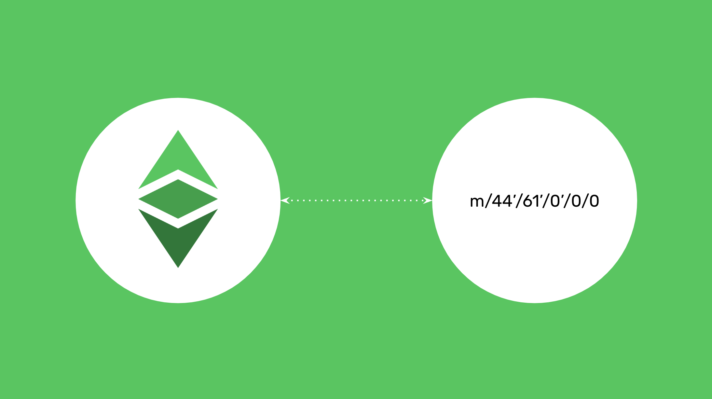

---
**You can listen to or watch this video here:**

<iframe width="560" height="315" src="https://www.youtube.com/embed/m_fRfs2II-k" title="YouTube video player" frameborder="0" allow="accelerometer; autoplay; clipboard-write; encrypted-media; gyroscope; picture-in-picture; web-share" allowfullscreen></iframe>

---


## What Are Derivation Paths?

Many people today using crypto are familiar with the secret passphrases they have to write down on paper or put in a safe place to be able to restore their blockchain addresses.

The way they work is that they are used to generate private and public key pairs for several blockchains. 

To generate these keys for several blockchains, and many addresses per blockchain, they pass through what are called derivation paths:

```
Secret passphrase -> derivation path -> many chains -> many addresses
```

In a way the derivation path is a way to split the paths so the same root passphrase may be used for generating multiple private and public key pairs.

## Using Your Secret Passphrase With Other Wallets

A derivation path has this structure:

```
m / purpose' / coin_type' / account' / change / address_index
```

The “m” is just a symbol that indicates this is a derivation path; the “purpose” term indicates to what [BIP](https://www.coindesk.com/learn/what-are-bips-and-why-they-matter-to-bitcoins-future/) it is related to; the “coin_type” term indicates the ID of the blockchain for which it is generating a key pair; the “account” term is the ordinal number of the address in a sequence to be able to generate more addresses.

The other two terms are either specific to Bitcoin or seldom used.

For example, the derivation path to generate an address in Bitcoin from a secret passphrase would be:

```
m/84’/0’/0’/0/0
```

“84” is the BIP to which this address corresponds, “0” is the chain ID of Bitcoin, and “0” is the first address in the sequence to be generated.

However, if one would use a different derivation path, for example:

```
m/84’/0’/1’/0/0
```

Then a totally different private key and address would be generated!

And, because over the years several wallet brands have used different standards, then it has created some headaches and problems with people trying to restore their addresses or migrating to different wallets.

For example, if one has created ETC addresses on MetaMask, but they transfer their secret passphrase to Trust Wallet, then they will not see their ETC addresses there!

This is because they are using different derivation paths.

## What Is The Standard Derivation Path for Ethereum Classic?



So, given that this is the case in the market, we are making this call to wallet brands to please use the standard derivation path for ETC.

The derivation path for ETC is very similar to that of Ethereum.

Ethereum has the standard base derivation path:

```
m/44’/60’/0’/0/0
```

The “coin_type” is 60 because that is Ethereum’s chain ID.

The Ethereum Classic standard derivation path is: 

```
m/44’/61’/0’/0/0
```

This is the base derivation path, with the correct “coin_type”, that all wallets should use.

## How Do Users Generate More ETC Addresses?

Above we say “the base derivation path” because it is only used to generate the first private key and address pair. 

From there, to generate more addresses, the sequence in the “account” term must be continued like this: 

```
m/44’/61’/0’/0/0
```

```
m/44’/61’/1’/0/0
```

```
m/44’/61’/2’/0/0
```

```
m/44’/61’/3’/0/0
```

Etc.

Each of the derivation paths above will generate a different private and public key pair in ETC.

## A Call to MetaMask

So, the main problem ETC users are experiencing is that they use MetaMask as one of the most popular Ethereum Virtual Machine wallets, but MetaMask generates ETC addresses using the Ethereum derivation path, which is:

```
m/44’/60’/0’/0/0
```

We kindly request the MetaMask team to configure their wallet so that when users add Ethereum Classic to their MetaMasks, using the chain ID 61, that they also use the following base derivation path with the correct “coin_type” like this:

```
m/44’/61’/0’/0/0
```

## A Call to MyEtherWallet

In the case of MyEtherWallet (MEW), a weird base derivation path is being used when users link their Ledger hardware wallets to their app.

MEW is using the following derivation path for Ledger ETC addresses:

```
m/44’/60’/160720’/0/0
```

But Ledger actually uses the correct standard derivation path for ETC, so we kindly request for MEW to adjust the derivation path for ETC when using Ledger in their service, which should be like this:

```
m/44’/61’/0’/0/0
```

## Don’t Worry If You See Different Addresses in Different Wallets!

All of the above should not alarm ETC users as this is just a sort of housekeeping issue in the different wallets.

To recover or see your ETC addresses that look different in other wallets, it is a matter of correcting the derivation path. 

Although MetaMask currently does not allow this, other wallets such as MyEtherWallet and MyCrypto do allow users to choose their derivation paths.

This means that, even if you can’t see your addresses initially when using a different wallet while using the same secret passphrase, your addresses are still under your control, and there is a way of gaining access to them again.

---

**Thank you for reading this article!**

To learn more about ETC please go to: https://ethereumclassic.org
