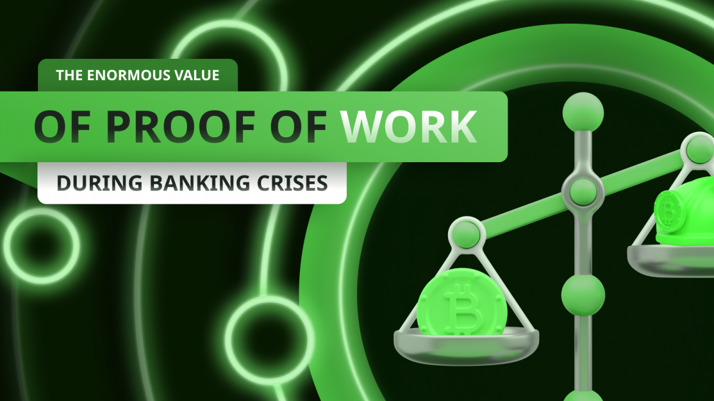

---
**You can listen to or watch this video here:**

<iframe width="560" height="315" src="https://www.youtube.com/embed/Hb-Pnh5BbGs" title="YouTube video player" frameborder="0" allow="accelerometer; autoplay; clipboard-write; encrypted-media; gyroscope; picture-in-picture; web-share" allowfullscreen></iframe>

---

In the previous class, 31, we talked about the focus of proof of work (POW) blockchains, which is that they always seek trust minimization. 

We explained the meaning of trust minimization and its benefits, and why it is the root of security in blockchains such as Ethereum Classic (ETC) and Bitcoin (BTC).

Trust minimization is important because trusted third parties in traditional systems manage our information and wealth, but they can behave badly, go bankrupt, or be hacked.

In this class, 32, we will talk about one of the negative impacts of these trusted third parties, which is when there are banking crises, and how proof of work blockchains are so valuable in such moments.

## The Banking Crisis of 2023

Early in 2023 we went through a roller coaster ride in the United States because some smaller banks were liquidated.

In a matter of five days three banks experienced runs that drained their funds and prompted the government to bail their customers out and liquidate the institutions.

The banks were the Silicon Valley Bank, whose customers were mainly tech startups, tech companies, and wealthy individuals; and Silvergate Bank and Signature Bank, both with many crypto companies and nonprofits as their customers.

However, those who had their money on POW blockchains such as ETC and BTC were much less affected emotionally and financially than those who held fiat money in banks or cryptocurrencies in crypto exchanges.

## The Crisis Was Used to Persecute Crypto Businesses

During the banking crisis of 2023 many crypto companies and nonprofits suffered a sort of persecution.

This was induced by central bank regulators who signaled to the market that exposure to crypto was not welcome by them.

This posture by the government made the liquidation of Silvergate Bank and Signature Bank more cumbersome than usual, creating uncertainty whether crypto companies and non-profits would even have banking relationships after the crisis.

Ironically, many of these crypto startups and organizations had their crypto holdings in centralized exchanges, which exposed the additional risk to trusted third parties they were running, which seemed contradictory to the ethos of the industry!

## Banking Crises Are Created By the System Itself!

One of the perversions of the fiat money system is that as it is so detached from reality, it creates its own problems, including banking crises!

The 2023 liquidations were caused by the central bank itself as it induced banks to buy treasury bonds, but then aggressively raised interest rates making bond prices plummet.

As banking institutions accumulated long maturity government bonds, interest rates were very low or near zero. When the COVID policies were enacted in 2020, the government printed trillions of dollars causing an increase in inflation that had to be controlled by the Federal Reserve.

When the central bank raised interest rates to control inflation, it did it at a very fast pace from near zero to more than 5% in a matter of 18 months. This collapsed the value of the bond market generating hundreds of billions in losses for banking institutions.

## Banks Are Essentially All Bankrupt

Banking crises occur because banks are essential permanently bankrupt, as [Caitlin Long](https://x.com/CaitlinLong_) has correctly pointed out. 

This is because banks do what is called maturity mismatch, they take deposits at short durations and lend out at longer durations. This lets them pick up an additional margin in interest rate differentials.

The problem is that the short term deposits by their customers are very liquid, so their clients can essentially withdraw their money whenever they want.

When the economy is stable, usually banks can get a hold of cash reserves from other depositors to finance withdrawals, but when all or most customers want their money at the same time, then banks have to fail.

## POW Blockchains Are a Rock and a Refuge Against Crises

Proof of work blockchains have no central banks or regulators, do not lend, they don’t have CFOs or treasuries who allocate funds in bad investments, no one can confiscate funds, and no one can tell anyone if they can open an account or not.

The main goal of Satoshi Nakamoto when he invented Bitcoin was to avoid trusted third parties as much as possible.

In blockchains such as ETC and Bitcoin, people can have their own addresses and exclusively control them through their private keys. No one else has access to their assets and the money is physically in their possession, not lent out.

This is an enormous change in paradigm because, on POW blockchains, owners of money control their own assets, while in the traditional banking systems nearly all the money is controlled by trusted third parties.

## The Additional Importance of Non-Custodial Wallets

Bitcoin and ETC were a great relief for many during the 2023 banking crisis.

However, the most important thing is to have your crypto assets in non-custodial wallets.

Merely owning BTC and ETC is good only up to a certain extent because the majority of the benefits are lost if they are held in centralized exchanges such as Coinbase, Kraken, Binance, OKX, or Bybit.

It is crucial for holders to move their cryptocurrencies to non-custodial wallets such as MetaMask, Trust Wallet, Ledger, Trezor, MyEtherWallet, MyCrypto, or Exodus.

Non-custodial wallets let users control their private keys and have direct access to their crypto assets on the blockchain bypassing trusted third parties, thus avoiding banking crises.

---

**Thank you for reading this article!**

To learn more about ETC please go to: https://ethereumclassic.org
