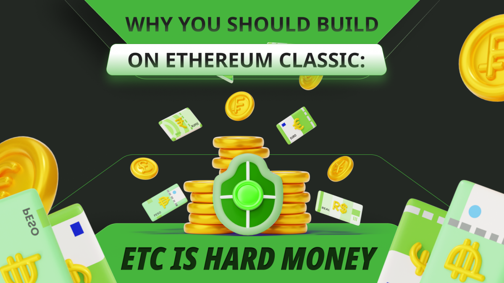

---
**由此收听或观看本期内容:**

<iframe width="560" height="315" src="https://www.youtube.com/embed/5wizIsM3zSo" title="YouTube video player" frameborder="0" allow="accelerometer; autoplay; clipboard-write; encrypted-media; gyroscope; picture-in-picture; web-share" allowfullscreen></iframe>

---

本文是一个系列的一部分，该系列将向dapp开发者解释为什么他们应该在以太坊经典（ETC）上构建。

系列标题将以“为什么您应该在以太坊经典上构建”作为前缀，后接该篇文章的亮点特性。

这个系列的九个亮点特性将是：

- ETC是工作量证明（PoW）
- ETC是硬通货
- ETC是可编程的
- ETC是完全复制的
- ETC是可组合的
- ETC是世界上最大的PoW智能合约区块链
- ETC上的应用是世界上最安全的应用
- ETC是代码即法律
- ETC是比特币但拥有以太坊技术

在这篇文章中，我们将解释为什么开发者应该在ETC上构建，因为它是硬通货。

## ETC是工作量证明

ETC是硬通货的第一个原因是因为它是一个工作量证明（PoW）区块链。

PoW最初被认为是数字黄金，因为工作量证明的哈希类似于现实世界中的黄金。

正如黄金对矿工来说非常难且成本高昂，PoW区块链中的哈希对计算机来说也是非常难且成本高昂的。

然而，在比特币和ETC中，PoW哈希并不是在网络中流通的货币，而是创建了本地代币来承担这种货币角色。

这些代币，BTC和ETC，就像数字黄金一样，因为创建区块的成本就是创建这些代币的成本。

## ETC有固定的货币政策

ETC代币是硬通货并充当货币，因为它具备了实现这一功能的所需特性。

ETC是稀缺的、耐用的、创建成本高的、便携的、可分割的、可互换的和可转移的。这些是经济学定义的货币的主要属性。

不仅ETC加密货币的创建成本高，因为只有矿工完成工作后才会发行硬币，而且它还有一个通缩且有供应上限的货币政策。

实际上，根据ETC的货币政策，流通中的ETC总量将达到210,700,000。

ETC是在每个新区块中创建的，最初在2015年每个区块支付5 ETC，从那时起大约每两年就减少20%。

截至本文撰写时，矿工每个区块的支付是2.048 ETC，这意味着年通胀率为3.37%，并且趋势向低。

## ETC将保持其长期价值

鉴于上述货币属性，它是一个PoW硬币，并且是可编程的，ETC通常被称为可编程的数字黄金。

正如现实世界中的黄金在数千年中保持其价值一样，ETC将在长期内保持其价值。

不仅ETC是良好且稀缺的货币，它还是以太坊经典区块链的本地代币。这赋予它两种维持其价值的经济功能：

- 它是用来支付矿工生产区块的硬币
- 它是用户用来支付燃气费的硬币

这些在基础网络协议中的两个角色为ETC提供了额外的可持续性。

## ETC将保护并增加用户的储蓄

作为dapp开发者，您希望用户享受优秀的产品并对您的解决方案满意。

在ETC中，您的用户不仅会享受到去中心化的好处，还会享受到一种将在长期内保护和增加他们储蓄的加密货币。

市场上有许多加密货币、代币和区块链，但只有少数能够提供真正安全且去中心化的区块链（如比特币和ETC）所承诺的原始保障。

以太坊经典可能成为行业中最安全的基础层区块链之一，并且是开发者构建世界上最安全应用以服务其客户的主要链。

这又是一个您应该在ETC上构建的理由！

---

**感谢您阅读本文！**

要了解更多关于ETC的信息，请访问：https://ethereumclassic.org
