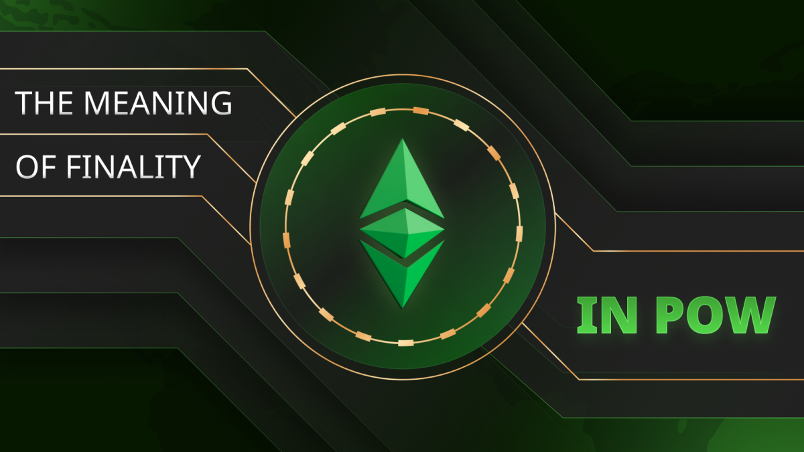

---
**You can listen to or watch this video here:**

<iframe width="560" height="315" src="https://www.youtube.com/embed/RtWd4Jrq0FA" title="YouTube video player" frameborder="0" allow="accelerometer; autoplay; clipboard-write; encrypted-media; gyroscope; picture-in-picture; web-share" allowfullscreen></iframe>

---

In the previous class, 32, we talked about one of the negative impacts of trusted third parties in traditional systems, which is when there are banking crises, and how proof of work blockchains are so valuable in such moments.

In a related topic, in this class, 33, we will talk about the meaning of finality with regards to money and decentralized applications (dapps).

We will explain the concept of finality in economics, that proof of stake (POS) finality is a gimmick, legal and software finality are weak, that finality does not magically exist because of man made rules, and that physical proof of work (POW) finality in blockchains such as Bitcoin (BTC) and Ethereum Classic (ETC) is true and strong.

## What Is Finality?

Finality is the term used to indicate that the state of a transaction has finalized and is irreversible. The finality of payments is when they are considered completed.

When a movement of funds is final, the receiving party has irrevocable access to the money.

Finality is a key concept in economics as commerce is dependent on the constant flow of transactions and payments.

Uncertainty in the finality of payments undermines the chain of transactions, thus the efficiency and growth of an economy.

Similarly, uncertainty in the finality of transactions and the state of dapps in a blockchain undermines human action taking place using these kinds of systems.

## False Claims In Proof of Stake Circles

There is a narrative in POS circles that proof of stake offers finality but that POW is inferior because it offers only probabilistic finality. 

This is a naive and dishonest argument because the probability that a transaction will be deleted or reversed (or entire accounts frozen, confiscated, or banned) in POS is much higher than in POW because POS is centralized and POW is decentralized.

In proof of stake blockchains, very few constituents control those systems, and there is no work done that puts a barrier to arbitrary changes. This means that they can get together and trivially modify balances, confiscate funds, or do any other kind of actions in the ledger.

Proof of work blockchains have much higher guarantees of finality because the work done in the past does constitute a barrier to tampering with the ledger. 

## Both POS and POW Are Probabilistic

The truth is that both POS and POW are probabilistic. 

The deterministic finality claimed in POS doesn’t exist because it is just a matter of installing a new version of the software and a new ledger with the changes to do away with finality.

In POS, the probability for a judge, regulator, or any civil authority forcing a chain to reverse a transaction is much higher than the probability that a POW blockchain transaction may be reversed, even if the same judge, regulator, civil authority, or even the military try to enforce it by violent means.

As said before, in proof of work blockchains, to change the history of the database is very difficult because it would imply doing the work all over again. This would be very costly and time consuming to be practical.

Additionally, POW enables all miners and node operators to split from the chain, thus providing another method of preserving the original untampered ledger.

## Proof of Stake Is As Insecure As the Banking System

That a POS protocol will not consider more changes after a certain number of blocks, slots, epochs, eras, or whatever they wish to call their convoluted designs, is just a gimmick as ”immutability” and “finality” are gimmicks in the traditional banking industry.

In banking, it’s just a matter of a judge putting out an order that the banks will freeze, confiscate funds, or stop or reverse payments from any account.

The idea that “determistic finality” exists because developers designed rules into a protocol is very naive. 

True finality must mean that changes are extremely difficult to implement.

## Proof of Work Is a New Paradigm in Financial Security

POW blockchain transactions are irreversible, not because the protocol has man made rules prohibiting it, but because the magnitude of the work that would be needed to do so is so large that it becomes completely impractical.

This is a substantial change in paradigm in finance because in the last 600 years entire societies had become nearly completely dependent on trusted third parties to handle payments and economic activity.

Blockchains move the responsibility and security of transactions and balances to the end users. It is only with the private keys of any address that the funds may be touched or interactions with dapps initiated.

This does away with the influence of trusted third parties in the economy.

## The New Paradigm in Finality Changes the Rules of Engagement for the Better

True finality in POW blockchains such as BTC and ETC forces authorities to seek other methods to fight crime and enforce the law, which actually respect basic human rights.

Today, authorities have developed incredibly invasive methods to control entire societies because they have influence or direct control over trusted third parties and through them they arbitrarily manipulate financial platforms such as payments.

With the existence of well designed POW blockchains, tampering with the payments platforms becomes impossible, therefore authorities need to target the actual agents committing crimes rather than assuming that entire groups or demographics must be criminals by default until proven innocent.

Mere legal, protocol, and software finality are weak. 

Physical, POW finality is strong and a force for good.

---

**Thank you for reading this article!**

To learn more about ETC please go to: https://ethereumclassic.org
