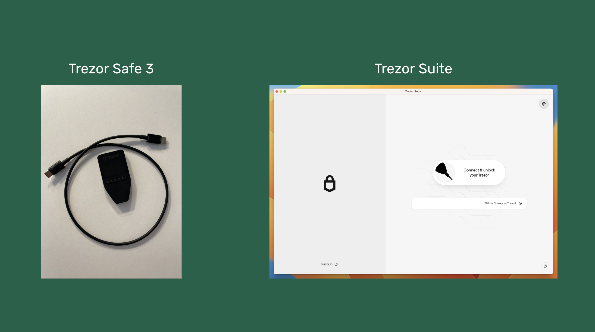
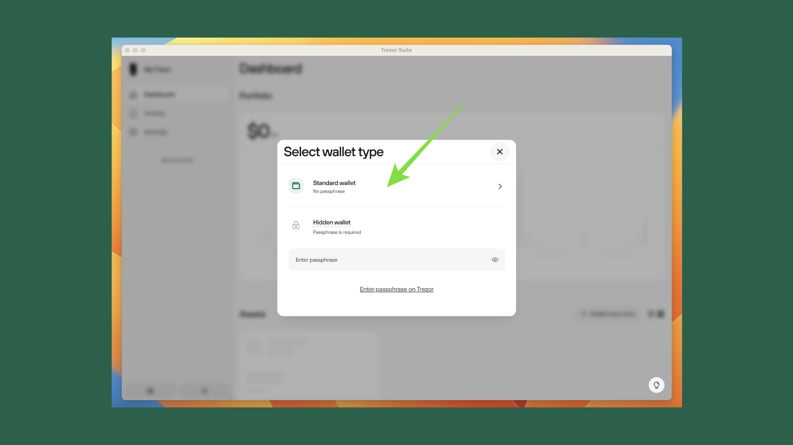
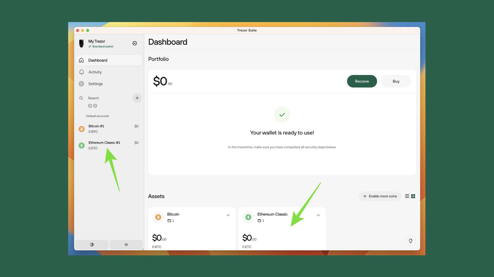
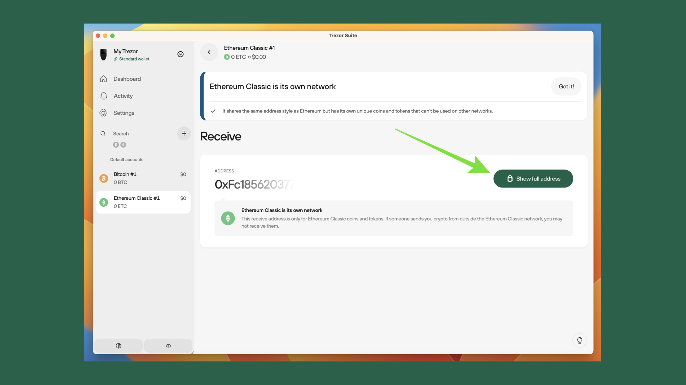
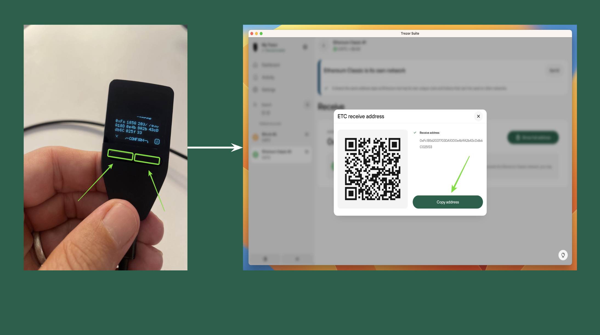
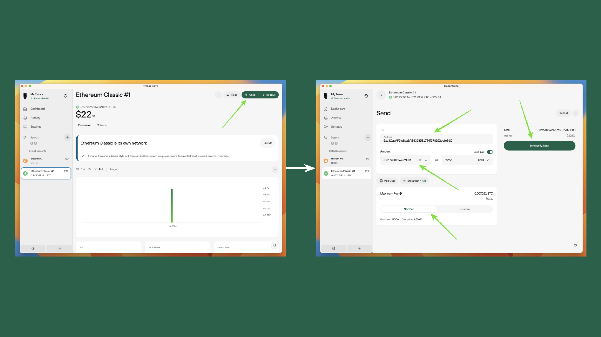
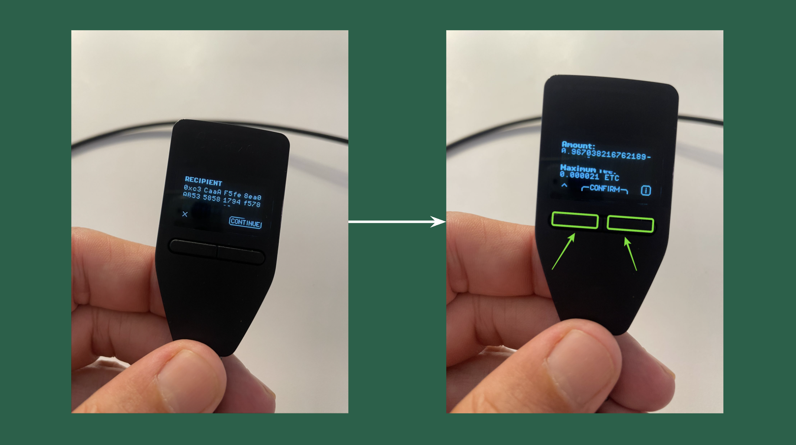

---
**You can listen to or watch this video here:**

<iframe width="560" height="315" src="https://www.youtube.com/embed/yReHZjsd2jI" title="YouTube video player" frameborder="0" allow="accelerometer; autoplay; clipboard-write; encrypted-media; gyroscope; picture-in-picture; web-share" allowfullscreen></iframe>

---

In this post we will explain how to send and receive Ethereum Classic (ETC) on the Trezor Safe 3.

We will show what are the Trezor components needed and then explain the steps to send and receive ETC. 

We will show the parallel actions on your Trezor Safe 3 and on your computer where appropriate.

## The Trezor Hardware and Software Components

Trezor Safe 3 is a hardware wallet, so to send or receive ETC on your Trezor you will need your hardware device and the app installed on your computer as explained in our post [“Using Ethereum Classic With Trezor”](https://ethereumclassic.org/blog/2024-03-27-using-ethereum-classic-with-trezor).

Following we created two sections that explain how to receive ETC first, and then how to send ETC, both using your Trezor Safe 3.

## Receive ETC

### 1. Open Trezor Suite and Connect Your Trezor Safe 3

The first step to receive ETC on your Trezor Safe 3 is to open the Trezor Suite app on your computer and to connect your Trezor device to it. 

Once connected, enter the PIN number on your device to associate it to the app on your computer.

### 2. Select Standard Wallet

Once you entered the PIN number on your device, the Trezor Suite app on your computer will ask you to select what type of wallet you will use. For this example, we selected the “Standard wallet” option, which is what we have been using in these tutorials.

### 3. Select the Ethereum Classic Asset

In the next step, the Trezor Suite app on your computer will show you the home of your wallet with the assets you have set up on it.

To receive ETC on your Trezor, select “Ethereum Classic” on the left hand vertical menu or click on the Ethereum Classic box in the assets section below. 

### 4. Get Your ETC Address

In the next screen, click on the “Receive ETC” button at the bottom of the page so that Trezor Suite may show you your ETC address.

When the popup box appears asking if the ETC will be received through the ETC network, press the “Confirm” button.

### 5. Show Full Address

In the next screen, Trezor Suite will show you a partial portion of your address because it needs to be confirmed with your Trezor hardware wallet.

Press on the “Show full address” button in this step and then go to your Trezor device.

### 6. Confirm and Copy Address

On your Trezor Safe 3 device you will need to enter your PIN number to unlock the address on your Trezor Suite app on your computer.

When you entered your PIN, then you will see the full address on your device and on your computer. If they are the same then the address is confirmed and you can go ahead and copy it and use it to receive ETC from third parties or other wallets.

## Send ETC

### 1. Set Up Trezor Suite and Trezor Safe 3

The first step to send ETC from your Trezor Safe 3 is to open the Trezor Suite app on your computer and to connect your Trezor device to it.

Once connected, enter the PIN number on your device to associate it to the app on your computer.

### 2. Select Standard Wallet

Once you entered the PIN number on your device, the Trezor Suite app on your computer will ask you to select what type of wallet you will use. For this example, we selected the “Standard wallet” option, which is what we have been using in these tutorials.

### 3. Select the Ethereum Classic Asset

In the next step, the Trezor Suite app on your computer will show you the home of your wallet with the assets you have set up on it.

To send ETC from your Trezor, select “Ethereum Classic” on the left hand vertical menu or click on the Ethereum Classic box in the assets section below. 

### 4. Prepare Transaction to Send ETC

In the next screen you will see the ETC home page of your wallet. To prepare a transaction to send ETC, click on the “Send” button on the top right hand corner.

Then, in the next screen enter the address where you want to send ETC to, the amount to send, whether you want a normal or custom gas fee level for this transaction, and then press on the “Review & Send” button.

### 5. Review Transaction

Next, you will see a popup box with the details of the transaction for you to review. 

However, because you are using a hardware wallet, you will need to go to it and confirm your transaction there.

### 6. Confirm Transaction on Your Trezor Safe 3 Device

On your Trezor Safe 3 device, you will see the recipient address on the screen. If it is correct, then press “CONTINUE”.

In the next screen, you will be able to review the amount and gas fee you selected.

If all looks good, then press on both buttons on your device as indicated in the screen and then go to the Trezor Suite app on your computer.

### 7. Send ETC

When you go to the Trezor Suite app on your computer you will see that the transaction is ready to send as it has been confirmed and signed by your Trezor Safe 3 device.

To send the ETC, press the “Send” button.

---

**Thank you for reading this article!**

To learn more about ETC please go to: https://ethereumclassic.org
