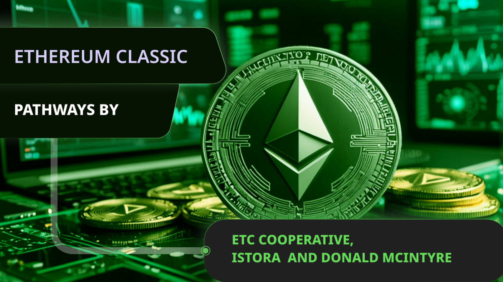

本文基于作者在2024年3月于阿曼举办的WDMS会议上的[演讲](https://www.youtube.com/live/vD7gS344qTg?t=20424s)。

智能合约是区块链行业的第二大发明。中本聪实际上计划为比特币设计智能合约。然而，由于其设计存在技术问题，比特币未能在其高度安全的环境中支持智能合约。因此，Vitalik Buterin发明了以太坊经典（ETC），即原始以太坊，成为一个POW区块链，具有数字黄金的特性，并且可以编程。因此，ETC结合了比特币的哲学和以太坊的技术。换句话说，这是两者的最佳结合。

ETC具有独特的属性组合，因为它不仅是一个POW区块链，并且有固定的货币供应计划，还能通过智能合约进行编程。这种独特定位使以太坊经典已经成为全球最大的POW智能合约区块链，也是总体上第五大POW区块链。这三大支柱实现了“代码即法律”和“不可阻挡”的愿景。

比特币的创新，通过POW实现了无许可性和健全的互联网货币。ETC的创新是将可编程性添加到无许可性和健全的互联网货币中，使应用程序不可阻挡。通过在以太坊经典中的智能合约，去中心化应用程序比任何运行在外部系统、数据中心或云服务上的应用程序都要安全得多。实际上，ETC中的应用程序是世界上最安全的应用程序。

作为一个具有智能合约的POW区块链，ETC在行业中拥有最有价值的地位，因为在以太坊转向POS后，ETC成为全球最大的可编程POW区块链，并且是数字黄金。POS智能合约区块链不安全，而没有智能合约的POW区块链则既不灵活又不安全。

由于ETC的供应上限为210,700,000 ETC；目前已经发行约1.48亿ETC；因此，还有大约62,700,000 ETC有待挖掘。按当前价格计算，这是超过14亿美元的未来收入，其中大约50%将在未来10年内支付给矿工。然而，由于其持续增长和作为可编程数字黄金的优越定位，挖矿收入可能会显著更高。

尽管人们常谈论这些项目的“路线图”，但ETC实际上没有路线图。正如ETC社区的重要成员Istora Mandiri[在社区网站上的一篇文章](https://ethereumclassic.org/blog/2023-04-08-roadmaps-and-pathways)中解释的那样，在真正去中心化的区块链中，不可能有路线图。技术路线图是由领导层、公司或基金会强加的。去中心化区块链如比特币或以太坊经典没有主席、领导者、管理员或经理。所有事情都通过改进提案过程进行，在ETC中，这个过程被称为“以太坊经典改进提案（ECIP）过程”。相反，ETC有一条通过ECIP过程在生态系统中通过激烈辩论逐步形成的路径。

话虽如此，ETC区块链有几个平行的技术升级提案，例如，这是ETC合作社为2024年提出的路径：

1. 增强客户端稳定性和功能：
   - 全面维护和增强Core-Geth客户端
   - 在跨客户端测试中的高级支持和改进（Core Geth、Erigon、Core Geth Light和Hyperledger Besu）

2. 网络观察和分析进展（检查网络健康状况）：
   - 节点基础设施用于观察和分析
   - 升级链和网络监控及事件反应系统
   - 升级网络分析工具
   - 统一的基础设施管理（目前有许多服务器是手动管理的，计划使用一个称为Ansible的单一部署接口来统一管理）

3. 技术开发和探索：
   - EVM对象格式（EOF）：继续倡导将其包含到以太坊和ETC中（2024年下半年ETH的布拉格硬分叉可能包括EOF，但它与Verkle树竞争）
   - EIP 1559：我们将探索在ETC上启用，以在这方面与以太坊完全保持一致
   - Verkle树：我们将研究在没有信标链的情况下对ETC的影响（Patricia Merkle Tree将被Verkle Trees取代，以实现无状态客户端）
   - 隐私导向的Geth部署，我们将研究在ETC的节点软件中添加隐私技术，如VPN服务
   - 增强回归测试和自动化发布流程（更好地检查新版本对旧版本的影响等）

Istora Mandiri本人提出的路径如下：

1. 采用Erigon客户端：
   - 以太坊经典的一个潜在路径是采用Erigon客户端，这将使网络更安全、更易访问。Erigon允许在更便宜的硬件上进行更快的同步和验证，使其成为更广泛用户的吸引选择，并增强ETC网络。

2. 可升级性和EVM对象格式（EOF）：
   - ETC的另一个可能方向是实施EVM对象格式（EOF），这将使以太坊虚拟机的可升级性成为可能。EOF对ETC特别有用，因为它在保持“代码即法律”原则的同时，打开了向后不兼容更新的大门。这也为更容易采用其他项目的EVM创新铺平了道路。

3. L2和隐私的密码学原语：
   - ETC还可以通过增加类似于以太坊主网计划支持的密码学原语来支持L2协议并增强隐私功能。这些增加将为扩展和改进网络的整体功能提供坚实的基础。

4. L2扩展和兼容性：
   - 虽然以太坊主网的长期目标是一级分片，目前的许多努力集中在L2协议上，如rollups。ETC可以利用这些技术并采用它们来实现兼容性和扩展。这将使以太坊经典能够与更广泛的以太坊生态系统共同成长。

而我在最近的一篇文章中提出的路线图如下：

1. 取消MESS（修正指数主观评分）：我很高兴地报告，这已通过2024年2月5日激活的ETC硬分叉Spiral在主网中实施！

2. 将Core Geth移动到以太坊经典社区GitHub库：这将恢复社区对节点客户端软件的主权。

3. 解决账户和EVM版本系统的向后兼容性：这将解决每次硬分叉时智能合约中断的风险。

4. 开发工具以轻松审核ETC的实际供应：这将确保ETC的正确供应数量。

5. 将区块大小设置为800万gas：这将有助于控制膨胀，并剥夺矿工改变区块大小的能力，如最近发生的那样。

---

**感谢阅读本文！**

了解更多关于ETC的信息，请访问：https://ethereumclassic.org
