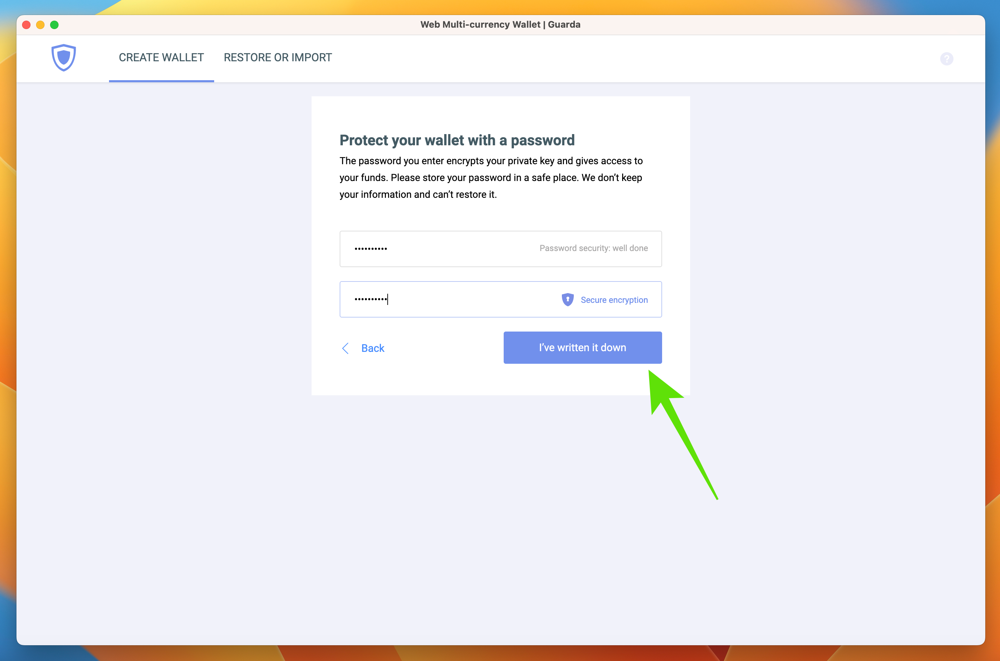
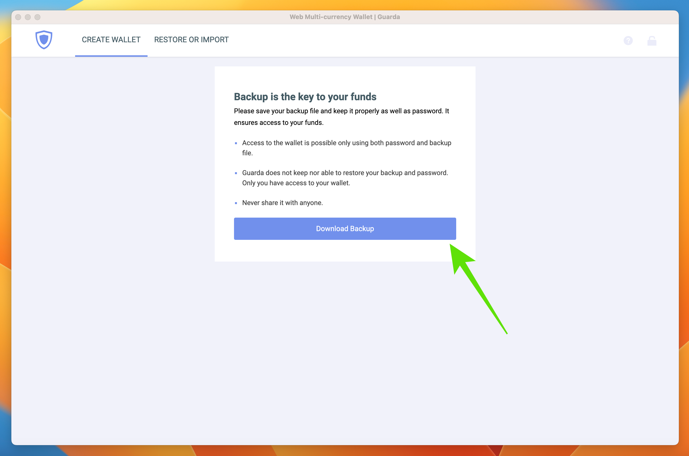
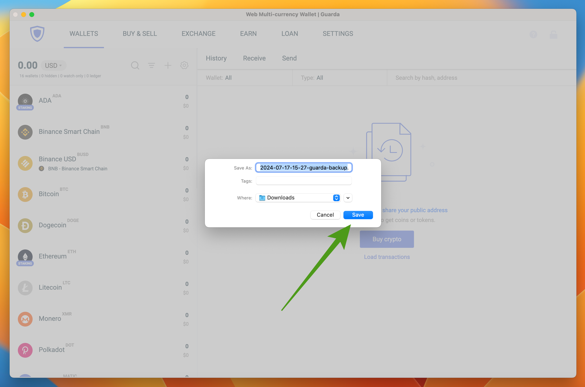
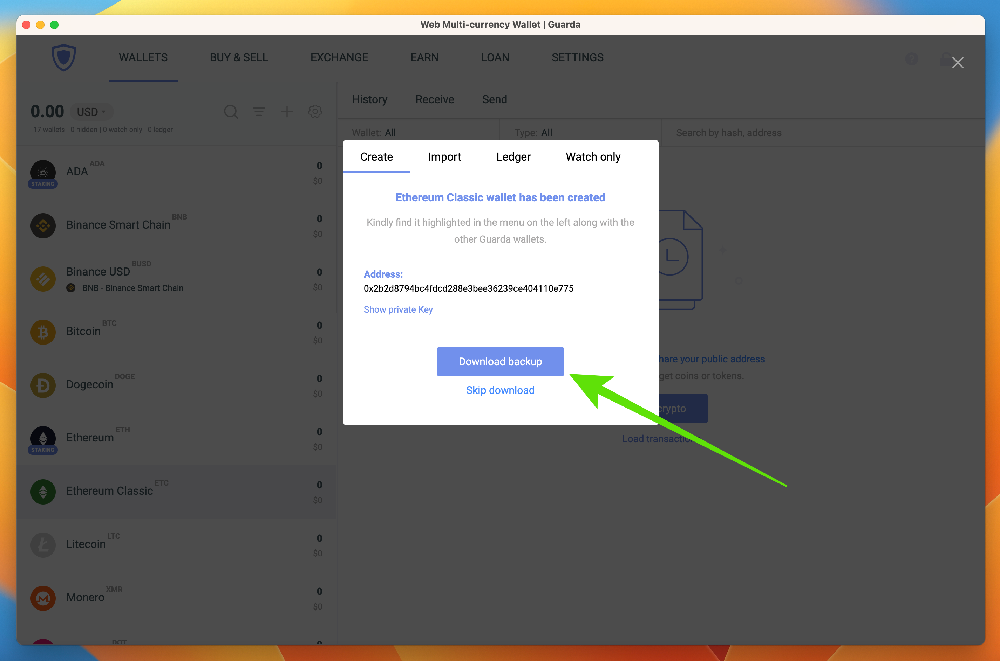

---
**You can listen to or watch this video here:**

<iframe width="560" height="315" src="https://www.youtube.com/embed/4IqQbHdVdFg" title="YouTube video player" frameborder="0" allow="accelerometer; autoplay; clipboard-write; encrypted-media; gyroscope; picture-in-picture; web-share" allowfullscreen></iframe>

---

In this article we will explain how to use Ethereum Classic (ETC) with Guarda Wallet.

Guarda Wallet is different than the wallets we usually cover in this website because rather than using secret passphrases as backups, it uses what they call a “backup file”.

In the following sections we will explain how to download, set up, and back up your Guarda Wallet.

## 1. Download Guarda Wallet

The first step to use ETC with Guarda Wallet is to download their desktop app and install it on your computer.

To do this go to https://guarda.com and download the Guarda Wallet app file for your operating system. After this, install it.

## 2. Open Guarda Wallet on Your Computer

Once your Guarda Wallet is downloaded and installed, open it and click on “Create a new wallet” to start the setup process (in a future post we will explain how to restore your Guarda Wallet from the backup file). 

## 3. Create a Password

The first thing that Guarda Wallet will ask you is to create a password of your wallet.

As Guarda Wallet does not store your password, it is important for you to write down this password and store it in a safe place. Without the password, you will not be able to access your crypto!

## 4. Download Backup File

In the next step, Guarda Wallet will ask you to back up your new wallet before you can even open it. This is to make sure you have your backup file stored in your computer before proceeding.

To do this, click on “Download Backup”.

## 5. Store the Backup File in a Folder on Your Computer

After clicking on “Download Backup” your operating system will prompt you to select in which folder in your computer to save the Guarda Wallet backup file. 

Make sure to put it in a folder that you may easily find in the future. Also, it would be an additional layer of security if you backed up the backup file in a pen drive in case you lose your computer or it gets stolen.

## 6. Create an Ethereum Classic Wallet on Guarda

Once you downloaded the Guarda Wallet backup file on your computer, you will be taken to the Guarda Wallet homepage.

To add Ethereum Classic as an asset to your wallet, click on the “+” sign link on the menu at the top of the crypto assets column.

## 7. Search For ETC and Select it

In the next step, Guarda Wallet will ask you to search for the asset you want to add.

To add ETC, enter “ETC” or “Ethereum Classic” on the search field and click on the ETC asset that will appear in the list.

## 8. Download the Updated Backup File

Before taking you back to the homepage of the app, Guarda Wallet will ask you to make a backup again as the previous one did not have the ETC data on it yet. This will be your new Guarda Wallet backup for all assets.

To backup your latest Guarda Wallet with your new ETC address, click on “Download backup”.

## 9. Your New ETC Wallet Is Added

After backing up your wallet and Guarda Wallet takes you back to the homepage of the app, you will see the ETC asset in the crypto assets list on the left hand column.

To open your ETC wallet, click on the “Ethereum Classic” asset.

## 10. Now You Can Use ETC on Guarda Wallet!

When Guarda Wallet takes you to the ETC homepage, you will see all the functions of your new Ethereum Classic address.

Now you can use Ethereum Classic on your Guarda Wallet to send, receive, exchange, or buy ETC.

---

**Thank you for reading this article!**

To learn more about ETC please go to: https://ethereumclassic.org
