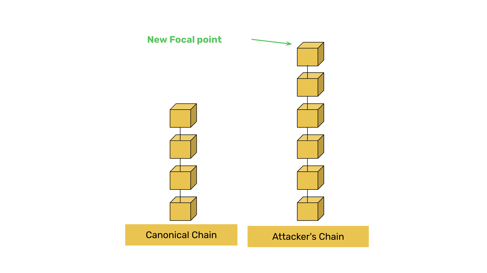

---
**You can listen to or watch this video here:**

<iframe width="560" height="315" src="https://www.youtube.com/embed/30Xhv2Wt85c" title="YouTube video player" frameborder="0" allow="accelerometer; autoplay; clipboard-write; encrypted-media; gyroscope; picture-in-picture; web-share" allowfullscreen></iframe>

---

In the previous class, 34, we talked about the activity that produces finality, and security in general, in POW blockchains such as ETC, which is mining.

We explained the metrics that make ETC a great business opportunity for cryptocurrency miners around the world.

In this class, 35, we will explain why proof of work (POW) blockchains must be attackable to be secure.

## The Bias to Add Subjectivity to Blockchains

51% attacks on POW blockchains are actions were dishonest actors accumulate more than 50% of the mining power in a blockchain and use it to delete past transactions in the ledger. The purpose of deleting transactions is to steal property from their victims.

51% attacks are a known attack vector in POW blockchains, but it is a feature, not a bug of these systems.

People think that because POW blockchains can be attacked if bad actors control more than 50% of mining that it is necessary to add subjective contraptions to reject alternative blocks or chains that are proposed to replace the canonical chain.

## Examples: Checkpointing and MESS

For example, if a POW network is working on block 100,000 and, suddenly, blocks 99,000 through 100,000 are reorganized by an attacker to replace or delete transactions from the recent past, then new rules such as checkpointing or to demand exponentially more hash power to reorganize blocks should be added to prevent these reorganizations.

Checkpointing predetermines certain block numbers in the past beyond which network nodes will not accept any reorganizations.

A system such as MESS (Modified Exponential Subjective Scoring) makes the nodes reject any reorganization of the chain if they have less than a certain hash power invested in it. 

## But Weak Subjectivity Is Bad

However, if this were done it would put in the hands of humans the decision of which is the correct chain to follow, and the whole decentralization of the blockchain accomplished by the simple verification of the work done, where anyone around the world can join and leave whenever they please with no permission nor checking with anyone else, would be thrown away just to prevent 51% attacks.

The original intent of using POW as a consensus mechanism was to eliminate any subjectivity precisely to enable complete decentralization of the system.

If nodes who are joining or exiting and joining again the network had to be checking with other nodes which is the correct blockchain based on arbitrary metrics and markers rather than on sheer computing power, then the figure of the “trusted third party” would be reintroduced into the system all over again!

## And 51% Attacks Are Not That Important Anyway

It is not worth introducing trust into POW blockchains just to prevent 51% attacks as these are not that severe anyway.

51% attacks are very narrow attacks, very unlikely, have very few victims, and victims have other ways of protecting themselves, such as waiting for the correct number of block confirmations when receiving coins.

This is why it is not a good idea to add subjective rules to POW blockchains, and why they HAVE TO BE ATTACKABLE TO ACTUALLY BE SECURE, not the other way around.

---

**Thank you for reading this article!**

To learn more about ETC please go to: https://ethereumclassic.org
