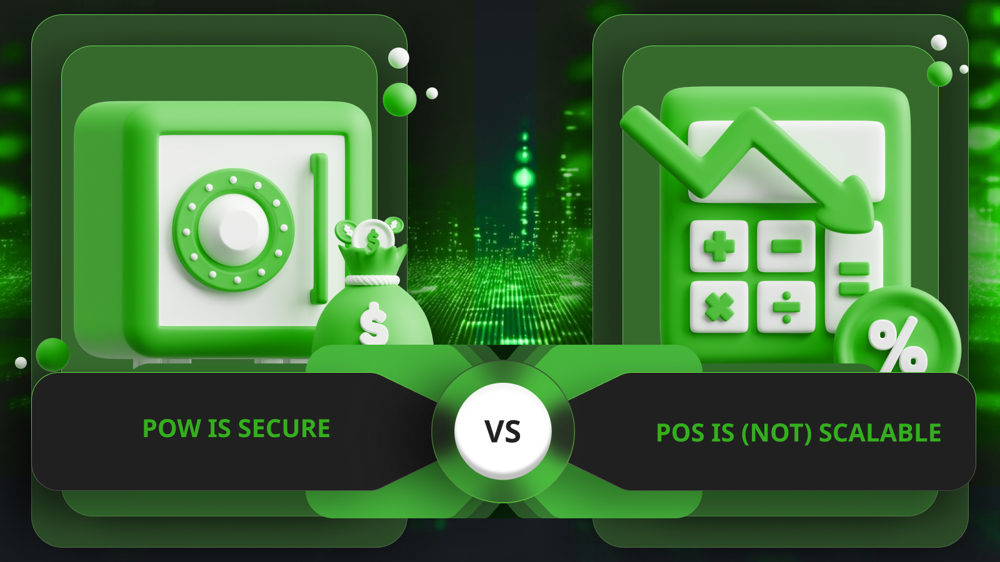

---
**You can listen to or watch this video here:**

<iframe width="560" height="315" src="https://www.youtube.com/embed/Nh2OPLswPSY" title="YouTube video player" frameborder="0" allow="accelerometer; autoplay; clipboard-write; encrypted-media; gyroscope; picture-in-picture; web-share" allowfullscreen></iframe>

---

## The Original Idea Was Full Replication of the Information

In his 1998 essay “[Secure Property Titles with Owner Authority](https://nakamotoinstitute.org/library/secure-property-titles/)” Nick Szabo, a blockchain pioneer, laid the foundation of how to secure property ownership and transfers in decentralized networks.

These ideas later became a reality in networks such as Bitcoin (BTC) and Ethereum Classic (ETC) powering the control and transfer of money and other crypto assets.

The basic assumption made in his proposal was that the information of the ownership records would be replicated in all participating nodes of the network.

This replication would provide security to users in three forms: trust minimization, redundancy of the property data on a global scale, and the ability to split from the network with the correct information in case of corruption.

## Proof of Work Consensus Was Just a Way To Synchronize the Nodes

It is likely that Satoshi Nakamoto stumbled with the solution of proof of work (POW) as a consensus mechanism. 

POW was really a way of producing Bit Gold, but the discovery that it could be used as the way to synchronize the nodes to be on the same page at the same time every ten minutes was the key to the creation of Bitcoin.

As of that moment, POW was not only a method of producing a scarce digital object but also became the mechanism by which all nodes in the network would keep a fully replicated copy of the data.

Up to this moment, the security model was trust minimization, redundancy, and splitting ability, but POW had something else in store.

## Then Proof of Work Became Part of the Security Model

Indeed, not only did POW produce digital scarcity, or digital gold in the form of Bit Gold, and consensus for all the nodes to keep the same exact copy of the database, but it also became an additional security mechanism, or a complement of the security model, by providing a barrier for attackers to corrupt the system.

As the way to produce Bit Gold requires a lot of work, and that work is what informs all nodes in the system to be synchronized in consensus, that same work then became a security component of the system by requiring anyone trying to reorganize the blockchain to do the whole work again. 

This feature added an incredibly powerful protection to the database that was already secure by the distribution of the information in all nodes of the system.

## But Full Replication Is Not Scalable

However, the mere feature of full replication of the information is a complex process that imposes different kinds of costs to the system.

In order to have all accounts, balances, smart contracts, and transactions distributed and replicated in all machines participating in the network, a lot of effort and time, consuming a lot of resources, is necessary.

If the idea of blockchains is to have as many nodes in the network replicating the data, then those nodes would need more bandwidth, local processing power, and storage capacity to be able to accommodate the growth of the system.

These restrictions imposed a limit in the size of the data that can be processed per round, therefore imposing a limit in the scalability of the system as measured by transactions per second.

## Proof of Stake Is Not Secure Because it Is Centralized

Many in the blockchain industry believe that POW is the reason for the lack of scalability in these systems, but the truth is that the requirement of replicating the information is.

Nevertheless, in search of scalability, and also to “save trees”, many projects have followed the path of proof of stake (POS) that doesn’t require POW mining, to solve the problem.

The problem with POS is that by not requiring work it lost the key component that enabled consensus in a decentralized way; it does not impose a cost to create the money; and it removed the barrier to prevent attackers to corrupt the system!

All these design changes have made POS blockchains centralized systems.

## Therefore Proof of Stake Is Insecure and Unscalable!

So, if POW was just a mere means to accomplish the real goal of blockchains, which is full replication of the information; and it also added more security attributes to the system; but all these benefits were removed from POS networks; and if full replication is what makes blockchains unscalable; then proof of stake cryptocurrencies are not only not secure but also not scalable!

This astounding reality is one of the most perplexing things in the industry: The reversal of all benefits and attributes of a new technology to pursue goals that were not accomplished and that actually reduced the promises of the whole experiment!

---

**Thank you for reading this article!**

To learn more about ETC please go to: https://ethereumclassic.org
