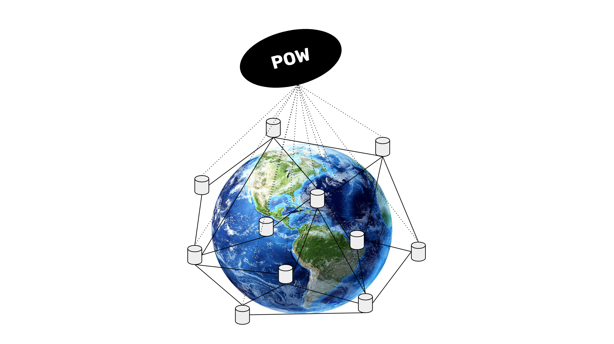

---
**由此收听或观看本期内容:**

<iframe width="560" height="315" src="https://www.youtube.com/embed/0JC-lgVwayE" title="YouTube video player" frameborder="0" allow="accelerometer; autoplay; clipboard-write; encrypted-media; gyroscope; picture-in-picture; web-share" allowfullscreen></iframe>

---

在第35课中，我们解释了为什么工作量证明（POW）区块链必须具有可攻击性才能确保其安全性，并探讨了POW的工作原理以及对主观性的偏向如何可能使共识机制面临风险。

POW 基于中本共识的格式和安全性限制了可以跨安全区块链分发的数据量，因此这些区块链无法扩展。

这意味着，使区块链无法扩展的并不是 POW 中的工作量。因此，在第36课中，我们将解释限制其扩展性的因素。

## 什么是可扩展性？

可扩展性指的是在单位时间内处理更多交易的能力。

比特币（BTC）每秒处理 7 到 14 笔交易，以太坊经典（ETC）可以处理每秒 7 到 17 笔交易，而 Visa 每秒处理 24,000 笔交易。

POW 区块链与传统大型支付系统之间的这一差距让许多人对这些网络的可扩展性不足感到担忧，并将其归咎于 POW 的工作量。

许多人认为 POW 无法扩展，因为它需要大量工作，因此必须处理更少的交易。

然而，POW 不是原因！

这种低效是由数据库在全球所有节点中的完全复制规则造成的，这需要更小且更慢的区块。要求完全复制的权益证明（POS）和权威证明（POA）网络也有同样的低效问题。

## 完全复制是罪魁祸首

在一个真正安全的POW区块链中，交易和区块都会完全重新传输到系统中所有参与的节点。这么做是为了让所有节点都可以保持并维护整个数据库的相同副本。

数据库的完全复制是区块链模型的关键安全策略。其想法是将所有账户、余额和智能合约尽可能多地复制到世界各地的计算机中，以使它们尽可能去中心化，并且不可能因人为或自然事件而被摧毁。

然而，在完全去中心化的情况下，数据库，尤其是包含账户、余额和智能合约的账本的完全复制在之前是不可能的，使得这些系统不安全且依赖于可信的第三方。

在完全去中心化的全球范围内实现完全复制的解决方案是工作量证明算法，这是中本共识设计的一部分。

但 POW 并不是使比特币和以太坊经典等区块链无法扩展的原因。全球范围内的完全复制是这些网络每日可处理交易量有限的原因。

这也是为什么以太坊转向POS却仍然无法扩展的原因。

## 任何真正去中心化的区块链都必须不可扩展

任何真正去中心化的POW区块链都将无法扩展。

中本共识设计规定，所有数据必须在所有节点中复制，所有节点必须保存数据库的完全相同的副本。

这对区块的大小和频率施加了物理限制，以确保所有节点在全球范围内的传播和同步性。

区块大小和频率的限制意味着每个区块中可以容纳的交易量有限，从而使这些系统无法扩展。

重要的是要理解，POW可以处理任何大小和频率的区块。正是由于重传和完全复制的限制，而非POW，才使得区块必须较小且不频繁。

## 完全复制（而非POW）如何限制可扩展性？

以下列出了几个原因，说明为什么在完全复制的网络中区块必须较小且不频繁，因此每秒产生的交易量较少：

**1. 膨胀：** 如果区块更大且更快，数据库将很快变得更大，这会给节点操作员带来压力，他们必须保持足够的计算存储能力来维护其节点。这将减少链上的节点数量并增加中心化。这也违反了行业中的常见原则，如“运行你自己的节点”和“验证一切”，因为人们会更倾向于使用第三方节点而不是自己的节点。

**2. 技术限制：** 与膨胀和中心化相关的技术原因是，较大且更快的区块将需要更高的带宽，从而限制了世界上某些地区和操作员处理数据的能力；它们还将需要更强大的CPU来验证区块，大型数据中心需要高带宽，限制了能力较强的操作员；新参与者或重新参与者的初始区块链下载时间（IBD）将非常长，增加了参与系统的障碍。

**3. 矿工经济：** 随着比特币和ETC的货币政策逐渐减少并达到上限，矿工们将在未来依赖费用收入。如果区块更大且更快，交易费用将更低。而稀缺的区块空间和低频率则意味着费用将更高，从而为矿工通过他们的哈希算力为这些网络提供的安全性提供资金。

**4. 区块传播：** 如果区块更大，区块传播将更慢。这将有利于世界上位置良好的大型矿工，并将网络中较小的、位于偏远地区的矿工排除在外，从而使采矿中心化。

## 第二层系统可以使POW可扩展

可扩展性的解决方案是构建第二层系统，这些系统可以处理更多的交易，将其净化后再在POW基础层上进行结算，或者用户只需支付更高的费用即可使用POW区块链的安全性。

例如，可以使比特币和ETC更具可扩展性的第二层系统包括通道支付系统（如 [闪电网络](https://en.wikipedia.org/wiki/Lightning_Network)）、在POW区块链上结算的常规中心化应用程序（如中心化交易所）、以及使用证明将其系统锚定在基础层POW区块链上的第二层去中心化网络（如[Polygon](https://www.coinbase.com/learn/crypto-basics/what-is-polygon) 和 [BitVM](https://www.coinbase.com/learn/crypto-glossary/what-is-bitcoin-bitvm)）。

---

**感谢您阅读本文！**

要了解更多关于ETC的信息，请访问：https://ethereumclassic.org
