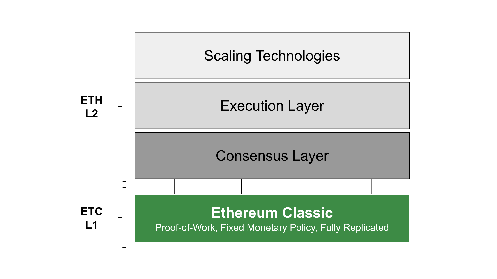

---
**由此收听或观看本期内容:**

<iframe width="560" height="315" src="https://www.youtube.com/embed/9pE8Q4bNqiM?si=iv6mDof1OXz5Wvxj" title="YouTube video player" frameborder="0" allow="accelerometer; autoplay; clipboard-write; encrypted-media; gyroscope; picture-in-picture; web-share" allowfullscreen></iframe>

---

在上一堂课（第10堂）中，我们讨论了工作量证明（POW）区块链中的非许可悖论。

非许可悖论指出，为了在POW区块链中保证非许可性，最影响该区块链的社区必须是非许可的。

这个概念与本节课（第11堂）有关，因为权益证明（POS）区块链在区块链或社区层面上也不是非许可的。

然而，如果以太坊（ETH）使用以太坊经典（ETC）作为将非许可性重新引入其系统的方式，这个问题可能得以解决。反过来，这将使ETC受益，因为它将获得以太坊的可扩展性。

我们将在本文中解释这个概念的基本原理。

## “ETC和ETH之间的互补”是什么意思？

正如介绍中所解释的，以太坊和ETC之间的互补意味着如果它们进一步集成它们的系统，两者都会获益。

如今，ETH和ETC都遵循相同的技术标准，称为“EVM标准”，即“以太坊虚拟机”范例，它将[智能合约](https://etherplan.com/ethereum-white-paper.pdf)引入了区块链行业。

然而，ETH和ETC的不同之处在于它们的共识机制采用了不同的方法。

ETH使用权益证明，这是一种[集中化](https://ethereumclassic.org/blog/2023-12-27-ethereum-classic-at-scale-is-decentralized-ethereum-is-centralized)且没有分叉选择的方法，而ETC使用工作量证明，这是唯一可以保证去中心化并具有分叉选择的方法。

另一方面，权益证明可能比工作量证明更具可扩展性。这意味着如果ETH和ETC在某个程度上进行集成，ETH将获得ETC的安全性，而ETC将获得ETH的可扩展性。

## ETH是不安全、复杂且容易中心化的

在迁移到权益证明之前，以太坊几乎与ETC相同。然而，由于POS是中心化的，ETH已经成为一个不安全、复杂且容易中心化的系统。

有时，ETH的[交易](https://ethereumclassic.org/blog/2023-02-22-ethereum-classic-is-censorship-resistant-ethereum-is-not)在其70％的情况下会受到审查。它面临的其他问题是大型权益池可能控制超过33％的验证器，这超过了系统的安全阈值。

除了这些中心化的趋势之外，ETH的权益投放几乎没有摩擦，因此具有非常高效的规模经济，这不可避免地导致大型权益利益和大型[权益精英](https://ethereumclassic.org/blog/2023-11-08-proof-of-stake-is-broken-because-of-its-incentives)变得更富有，而经济的其余部分变得更贫困。

## ETH在全球范围内没有分叉选择

除了普遍的中心化之外，权益证明的弱点在于它没有分叉选择。分叉选择是一种使所有节点和验证器在发生分裂或分叉时知道在哪个链上工作的方法。

工作量证明对于在发生分裂或分叉时所有节点必须做出的选择非常明确，所有节点必须遵循已完成工作最多的链，这是非常容易计算和验证的。

权益证明没有这一点，因此必须依赖于可信的第三方来了解其他所有人正在使用哪条链！

从某种意义上说，以太坊容易中心化，这很大程度上是因为缺乏分叉选择。当有分叉选择时，节点可以随时加入和离开，而无需与其他任何人核对。换句话说，它是非许可的。

以太坊是许可的，因为始终需要与可信的权威核实正确链的位置。

以太坊在发生黑天鹅事件之前需要获得分叉选择，否则将是灾难性的。

## ETH可以保留其执行层

以太坊很复杂，因为它分为两个层面，即执行层（EL）和共识层（CL）。这种组合系统充满了[复杂性](https://www.lynalden.com/proof-of-stake/)。

然而，在与ETC进行潜在集成的情况下，以太坊可以保留其执行层，但使用ETC作为其共识层。

ETC可以成为ETH的共识层，通过从以太坊网络接收ETH块模板并对其进行散列来实现。在对其进行散列之后，它们可以返回给以太坊节点网络进行验证，以便该系统中的所有计算机都能知道每一轮中的正确区块。

通过这个相同的系统，ETH中的所有节点也可以在发生分裂或分叉时知道哪条是正确的链。

## ETH可以保留其执行和共识层

在另一种模型中，以太坊可以保留其EL和CL层，但在特定间隔内使用ETC来标记其状态。

例如，ETC可以在每100或1000个区块（每20或200分钟）作为一个检查点系统，防止权益者超越这些限制来颠倒和篡改链。

它的工作原理是以太坊可以继续生成区块，就像今天一样，但它将其整个状态发送到ETC，以便在POW区块链中记录每100或1000个区块。

如果由于某种原因ETH链分裂或被攻击者颠覆，那么节点可以转到ETC链，检查最后一个检查点，然后从那里继续，而不是试图通过在社交层争论来找到正确的链。

## 作为基础层的POW的不可避免性

上述提出的ETC和ETH互补的两种模型都将使以太坊获得POW的关键优势；即对于全球所有机器来说，有一种明确的方式知道什么是正确的链，以便它们可以随时加入和离开，而无需任何中央控制；并且在分割或攻击的情况下提供分叉选择。

随着世界意识到POS是一个幻觉，这种锚定在整个领域是不可避免的，除非他们希望最终消灭以太坊和其他POS系统。

但是，考虑到竞争如此激烈，市值在游戏中，很有可能一旦有人采取行动，其他人就会跟随。

在这个过程中，POW区块链，如ETC，将在保持其高度安全的共识系统的同时，在可扩展性方面获得优势。

---

**感谢阅读本文！**

要了解更多关于ETC的信息，请访问：https://ethereumclassic.org
